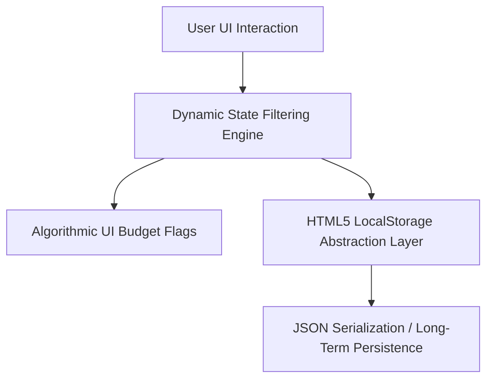

# 📊 Advanced Expense Tracker
[🔗 Click Here to Launch the Live Web App](https://netlify.app)

A high-performance, minimalist, web-based financial analytics dashboard built using AI-native rapid prototyping workflows. This application empowers users to manage micro-budgets dynamically with strict architectural data handling.

## 🏗️ Core Technical Architecture & Logic

- **Dynamic State Filtering:** Implements array mapping and conditional logic (similar to Python list comprehensions) using JavaScript's `.filter()` protocol. It instantly recalculates the entire system analytics based on localized category scopes (Food, Entertainment, etc.).
- **Persistent Micro-Storage (State Management):** Uses an HTML5 `LocalStorage` abstraction layer to ensure structured persistence. Application parameters and datasets undergo strict JSON serialization/deserialization to guarantee the browser runtime state remains operational upon manual hard refreshes.
- **Algorithmic UI Budget Flags:** Contains real-time monitoring algorithms tracking system states (`Current Expenditures` vs. `Pre-set Thresholds`). Features a ternary conditional workflow that dynamically mutates user interfaces (shifting visual arrays from Green to Yellow to Red) and triggers emergency alerts when variables exceed bounded metrics.

## 🛠️ Tech Stack & Systems Environment
- **Core Engine:** TypeScript / JavaScript (ES6+)
- **Storage Interface:** Web Storage HTML5 API
- **Layout & Design Systems:** Tailwind CSS / Modern CSS Variables
- **Deployment Platform:** Vercel / Netlify Deployment Pipelines
